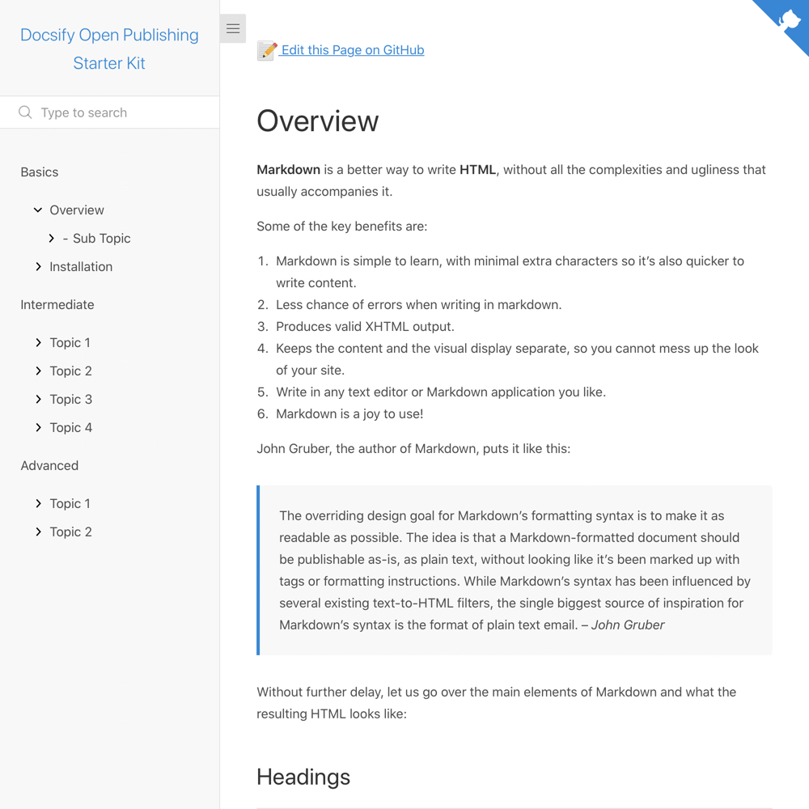

# Docsify Open Publishing Starter Kit for Import

> This is a starter kit to create an open [Docsify](https://docsify.js.org) documentation site on your own PaaS (such as Jelastic), with a link automatically created on each page to edit the source Markdown text on GitHub.

📸 Docsify Open Publishing for Import Screenshot
---

_Figure 1. Docsify Open Publishing Starter Kit for Import. Explore a demo of Docsify at [hibbitts-design.github.io/docsify-open-publishing-starter-kit/](https://hibbitts-design.github.io/docsify-open-publishing-starter-kit/)_

🚀 General Install Instructions
---
**Pre-flight Checklist**  

1. GitHub account

**Installation Steps**  

1. Fork this repository
2. Copy the Git address of your newly forked GitHub repository
3. Create your PaaS environment (i.e. Apache Web server)
4. Setup and configure the needed service to push GitHub repository changes to your PaaS environment (for example, on Jelastic this would be the [Git-Push-Deploy package](https://jelastic.com/blog/git-push-deploy-to-containers/)). The first push will basically install Docsify for you on your PaaS.
5. And you're done!

📝 "Edit the Page on GitHub" Link Setup
---

1. Edit the file `index.html` in your imported Docsify files
2. Find the sample GitHub URL `'https://github.com/hibbitts-design/docsify-open-publishing-starter-kit-for-import'` and replace it with your own GitHub project URL, for example `'https://github.com/YourGitHubUsername/Docsify/blob/master/docs/'`
3. Save your changes.

📚 Learn More about Docsify
---
[Docsify Documentation](https://docsify.js.org/#/?id=docsifyg)

🙇‍Credits and Special Thanks
---
[Docsify Themeable](https://github.com/jhildenbiddle/docsify-themeable)  
